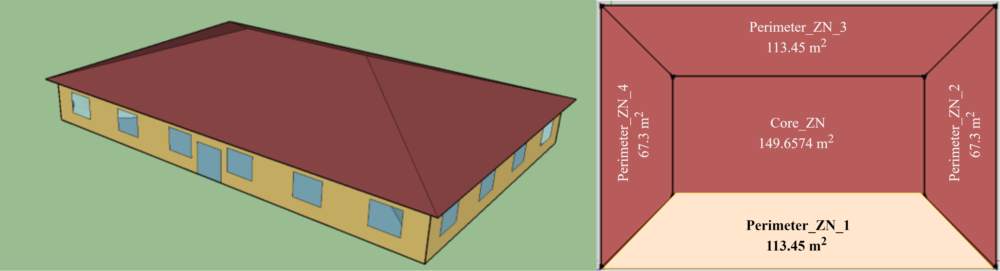

> **Note**: 
>
> For better readability of this document, it is recommended to use a Markdown viewer or tool.
>
> **Disclaimer**: 
> 
> The information contained in this document is for general information purposes only. While we strive to keep the information up to date and correct, we make no representations or warranties of any kind, express or implied, about the completeness, accuracy, reliability, suitability, or availability with respect to the content provided. Any reliance you place on such information is strictly at your own risk.
> 
> Certain commercial entities, equipment, or materials may be identified in this document in order to describe an experimental procedure or concept adequately. Such identification is not intended to imply recommendation or endorsement by the National Institute of Standards and Technology, nor is it intended to imply that the entities, materials, or equipment are necessarily the best available for the purpose.

## Table of Contents

Overview
- [Introduction](#introduction)
- [Repository Structure](#repository-structure)
- [Data Description](#data-description)

Technical Details
- [Methodology](#methodology)
- [Software Testbed](#software-testbed)
- [Hardware Testbed](#hardware-testbed)
  - [System Configuration](#system-configuration)
  - [Local Control Sequence](#local-control-sequence)
- [Test Scenarios](#test-scenarios)

Additional Information
- [Contact Information](#contact-information)
- [Cite the Datasets](#cite-the-datasets)
- [References](#references)

## Introduction
This document provides comprehensive details of the datasets generated from the project titled, "Hardware-in-the-Loop Laboratory Performance Verification of Flexible Building Equipment in a Typical Commercial Building." This project was financially supported by the U.S. Department of Energy under grant number EE-0009153. These datasets were obtained from extensive hardware-in-the-loop (HIL) testing of a Water Source Heat Pump (WSHP) system at the Texas A&M University (TAMU), conducted under a diverse range of conditions and operational settings. 

## Repository Structure
**[data](data)** contains all datasets organized into three levels of subfolders:
- Level-1 (LOC: Atlanta, Buffalo, NewYork, Tucson): These folders present different locations where testing was performed.
- Level-2 (GEB: Eff, Shed, Shift): These folders present various operational scenarios for the WSHP system.
- Level-3 (VAR: Default, DenOcc, EnergySave, etc.): These folders present specific case scenarios under the respective operational scenario. These scenarios are further explained in [Test Scenarios](#test-scenarios).

**[raw](raw)** contains all the raw datasets corresponding to each dataset in the [data](data) folder.

**[assets](assets)** contains related figures, metadata, testing settings, and data schema.

## Data Description
Data point definitions can be found in [assets/Metadata.csv](assets/Metadata.csv).

See [assets/brick/HIL_WSHP_Brick_v1-3-0.ttl](assets/brick/HIL_WSHP_Brick_v1-3-0.ttl) and [assets/brick/HIL_WSHP_Brick_v1-3-0_DenseOcc.ttl](assets/brick/HIL_WSHP_Brick_v1-3-0_DenseOcc.ttl) for the Brick models that represent the data points and their relationships. Specifically, the `_DenseOcc` version is associated with the data tested under the dense occupancy `DenOcc` scenario. These models were validated against [Brick v1.3.0](assets/brick/Brick_v1-3-0.ttl) and its [occupancy extension](assets/brick/brick_occ_ext.ttl). The following figures show the data points relationships created within the Brick models.

## Methodology
The datasets were generated using a Water Source Heat Pump Hardware-In-the-Loop Flexible load Testbed (WSHP HILFT). The figure below illustrates the general framework of a HILFT, consisting of two parts: the hardware testbed and the software testbed. The software testbed includes a virtual building model, a Grid-interactive Efficient Building (GEB) control model, and a ground loop heat exchanger model. The virtual building model further incorporates a zone load model, an occupant comfort & behavior model, and an airflow model. For more detailed information about the development and integration of the general HILFT (not limited to WSHP HILFT), please refer to [^1]. For specific details regarding the implementation of the WSHP HILFT, please refer to [^2]. The figure below provides an overview of the general HILFT framework.

## Software Testbed
### Zone Load Model
The zone load model used in this study was adapted from the small office model of [Commercial Prototype Building Models](https://www.energycodes.gov/prototype-building-models). The selected zone for the Hardware-in-the-Loop (HIL) study was **Perimeter_ZN_1**, while other zones were served by the ideal load systems within EnergyPlus.

### Occupant Behaviors and Airflow Simulation
The occupant behavior model was adapted from Langevin et al. [^3]. Indoor airflow simulation was employed using the approach documented in [^4] to enhance the simulation of the local ambient environment for each occupant agent, i.

### Ground Loop Heat Exchanger Model
The ground loop heat exchanger (GLHE) model was specifically designed for the WSHP HILFT to simulate the inlet water condition for the WSHP system. The borehole depth of the GLHE was determined based on the ground temperature of each testing location using GLHEPro. The configuration details for the ground loop heat exchanger are provided below. For more details regarding the GLHE, please refer to [^2].

| Location | Ground Temperature | Borehole Depth     |
| ---      | ---                | ---                |
| Atlanta  | 64 °F (17.8 °C)    | 370 ft (112.8 m)   |
| Buffalo  | 50 °F (10 °C)      | 813.3 ft (247.9 m) |
| New York | 56.5 °F (13.6 °C)  | 522.3 ft (159.2 m) |
| Tucson   | 72.8 °F (22.7 °C)  | 278.5 ft (84.9 m)  |

## Hardware Testbed
### System Configuration
The figure below depicts the WSHP system configuration. This system is equipped with one zone emulator that is built into the duct system, and a hydronic system with a chiller and a water heater that provide constant flows of chilled or hot water as the heat sink or source to the WSHP and the air-side emulator load coil. The figure only focuses on the WSHP system being tested. For more details regarding the complete HIL setup, please refer to [^2].

### Local Control Sequence
The heat pump system is controlled based on the zone return air temperature and the thermostat setpoint using a PID-based algorithm. The detailed control algorithm is not known explicitly due to commercial restriction.

## Test Scenarios
This data repository includes real-time HIL WSHP testing data considering:
- Locations: Atlanta, Buffalo, New York, and Tucson; 
- Grid-interactive Efficient Building (GEB) scenarios: Efficiency (Eff), Load Shedding (Shed), and Load Shifting (Shift); 
- Other variations: weather condition, control strategy, building type, occupancy, occupant behavior, and thermal energy storage (TES). 

The **Default** cases (i.e., the third column of the table) were tested with typical summer weather, using a rule-based control (RBC) strategy, with a typical building type, occupancy, and occupant behaviors, and without TES. Each subsequent column header points to the deviation from this default setting. 

Details regarding the test settings of these scenarios can be found in [assets/WSHP_Test_Settings](assets/IBAL_Test_Settings.pdf).

| Location | GEB Scenario | Default | ExtrmSum | TypShldr | ExtrmWin | MPC | STD2019 | DenOcc | EnergySave | TES |
| ---      | ---          | ---     | ---      | ---      | ---      | --- | ---     | ---    | ---        | --- |
| Atlanta  | Eff          | x       | x        | x        | x        | x   | x       | x      | x          | x   |
|          | Shed         | x       | x        |          |          | x   | x       | x      | x          | x   |
|          | Shift        | x       | x        |          |          | x   | x       | x      | x          | x   |
| Buffalo  | Eff          | x       | x        | x        | x        | x   | x       | x      | x          | x   |
|          | Shed         | x       | x        |          | x        | x   | x       | x      | x          | x   |
|          | Shift        | x       | x        |          | x        | x   | x       | x      | x          | x   |
| New York | Eff          | x       | x        | x        | x        | x   | x       | x      | x          | x   |
|          | Shed         | x       | x        | x        | x        | x   | x       | x      | x          | x   |
|          | Shift        | x       | x        | x        | x        | x   | x       | x      | x          | x   |
| Tucson   | Eff          | x       | x        | x        | x        | x   | x       | x      | x          | x   |
|          | Shed         | x       | x        | x        | x        | x   | x       | x      | x          | x   |
|          | Shift        | x       | x        | x        | x        | x   | x       | x      | x          | x   |

## Contact Information
For any additional questions, clarifications, or feedback, please reach out to:

- **Jin Wen, PhD**: 
  - **Email**: jw325@drexel.edu

- **Zheng O'Neill, PhD**:
  - **Email**: zoneill@tamu.edu

- **Zhelun Chen, PhD**: 
  - **Email**: zl.chen.career@gmail.com

## Cite the Datasets
Please cite the datasets as below:

*TBD*

## References
[^1]: Chen, Zhelun, et al. "Development of a Hardware-in-the-loop Testbed for Laboratory Performance Verification of Flexible Building Equipment in Typical Commercial Buildings." ASHRAE Transactions 128 (2022). [[Paper](https://arxiv.org/abs/2301.13412)]

[^2]: Calfa, Caleb, et al. "Performance assessment of a real water source heat pump within a hardware-in-the-loop (HIL) testing environment." Science and Technology for the Built Environment 29.10 (2023): 1011-1026.

[^3]: Langevin, J., et al. "Simulating the human-building interaction: Development and validation of an agent-based model of office occupant behaviors." Building and Environment 88 (2015): 27-45. 

[^4]: Zhang, Yun, et al.  "CFD-Trained ANN Model for Approximating Near-occupant Condition in Real-time Simulations." ASHRAE Topical Conference Proceedings. American Society of Heating, Refrigeration and Air Conditioning Engineers, Inc., 2022.
